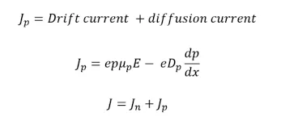
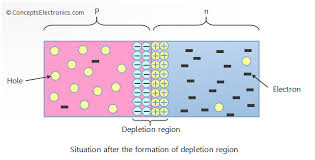
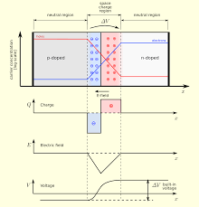

# PN Junction Theory and Mechanisms

## Theory

A **PN junction** is formed by bringing together p-type and n-type semiconductor materials. These semiconductors have distinct properties due to their doping:

- **P-Type:** Contains an excess of holes (majority carriers) and a few electrons (minority carriers) due to trivalent impurities (e.g., boron in silicon).
- **N-Type:** Contains an excess of electrons (majority carriers) and a few holes (minority carriers) due to pentavalent impurities (e.g., phosphorus in silicon).

When these materials join, two fundamental processes occur:
1. **Diffusion:** Majority carriers diffuse across the junction due to concentration gradients.
2. **Drift:** An electric field develops that causes drift of carriers in the opposite direction. Drift flow of current is in the opposite direction to diffusion current.

## Key Concepts and Physical Mechanisms

### 1. Formation of Depletion Region

When p-type and n-type semiconductors make contact:
- Electrons diffuse from n-type to p-type region, leaving behind immobile positive donor ions.
- Holes diffuse from p-type to n-type region, leaving behind immobile negative acceptor ions.
- This creates a **depletion region** (space charge region) containing exposed ionic charges.
- The exposed ions create an internal **electric field** (E-field) that opposes further diffusion.

The built-in potential (`V_bi`) across the junction at thermal equilibrium is:

V_bi = (kT/q) * ln((N_a * N_d) / (n_i^2))

Where:
- `k`: Boltzmann constant (`1.38 × 10^-23 J/K`)
- `T`: Absolute temperature (K)
- `q`: Elementary charge (`1.6 × 10^-19 C`)
- `N_a`: Acceptor concentration in p-type region
- `N_d`: Donor concentration in n-type region
- `n_i`: Intrinsic carrier concentration

### 2. Electric Field and Charge Distribution

The electric field in the depletion region varies with position. For an abrupt junction:

E(x) = (qN_d / ε_s) * (x + x_n) for -x_n ≤ x ≤ 0 (n-side)
E(x) = (qN_a / ε_s) * (x - x_p) for 0 ≤ x ≤ x_p (p-side)

Where:
- `ε_s`: Semiconductor permittivity
- `x_n, x_p`: Depletion region widths in n and p regions

The total depletion width (`W`) follows:

W = x_n + x_p = sqrt((2ε_s / q) * (1/N_a + 1/N_d) * (V_bi - V_a))

Where `V_a` is the applied voltage (positive for forward bias).

### 3. Current-Voltage Characteristics

#### Forward Bias

When \(V_a > 0\), the current follows the diode equation:

I = I_s * (e^(qV_a / nkT) - 1)

Where:
- `I_s`: Reverse saturation current
- `n`: Ideality factor (1 for diffusion, 2 for recombination-dominated current)

The reverse saturation current is:

I_s = qA * ((D_n / L_n) * n_p + (D_p / L_p) * p_n)

Where:
- `D_n, D_p`: Diffusion coefficients
- `L_n, L_p`: Diffusion lengths
- `n_p, p_n`: Minority carrier concentrations

#### Reverse Bias

When \(V_a < 0\):
- Depletion width increases
- Current saturates at \(-I_s\) until breakdown
- Minority carriers constitute the reverse current

### 4. Junction Capacitance

Two types of capacitance exist:

1. **Depletion (Junction) Capacitance:**
   $$
   C_j = \frac{\epsilon_s A}{W} = \frac{C_{j0}}{\sqrt{1 - V_a/V_{bi}}}
   $$

2. **Diffusion Capacitance** (forward bias):
   $$
   C_d = \frac{\tau I}{V_T}
   $$

Where:
- \(\tau\): Carrier lifetime
- \(V_T = \frac{kT}{q}\): Thermal voltage

### 5. Temperature Effects

Temperature influences:
- Built-in potential (decreases with \(T\))
- Reverse saturation current (increases exponentially with \(T\))
- Bandgap (decreases with \(T\))
- Carrier mobilities and diffusion coefficients

## Applications

PN junctions are fundamental to:
1. **Rectification:** AC to DC conversion
2. **Signal Detection:** Small-signal detection and mixing
3. **Voltage Regulation:** Using breakdown characteristics
4. **Photodetection:** Converting light to electrical signals
5. **Light Emission:** LEDs and laser diodes

## Diagrams

### 1. Formation of Depletion Region

### 2. Electric Field and Charge Density
