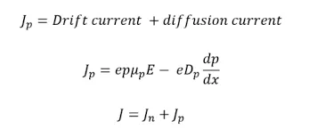
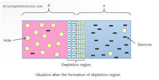
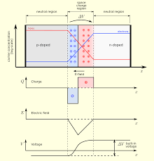

# PN Junction Theory and Mechanisms

## Theory

A **PN junction** is formed by bringing together p-type and n-type semiconductor materials. These semiconductors have distinct properties due to their doping:

- **P-Type:** Contains an excess of holes (majority carriers) and a few electrons (minority carriers) due to trivalent impurities (e.g., boron in silicon).
- **N-Type:** Contains an excess of electrons (majority carriers) and a few holes (minority carriers) due to pentavalent impurities (e.g., phosphorus in silicon).

When these materials join, two fundamental processes occur:
1. **Diffusion:** Majority carriers diffuse across the junction due to concentration gradients.
2. **Drift:** An electric field develops that causes drift of carriers in the opposite direction. Drift flow of current is in the opposite direction to diffusion current.

## Key Concepts and Physical Mechanisms

### 1. Formation of Depletion Region

When p-type and n-type semiconductors make contact:
- Electrons diffuse from n-type to p-type region, leaving behind immobile positive donor ions.
- Holes diffuse from p-type to n-type region, leaving behind immobile negative acceptor ions.
- This creates a **depletion region** (space charge region) containing exposed ionic charges.
- The exposed ions create an internal **electric field** (E-field) that opposes further diffusion.

### 2. Electric Field and Charge Distribution

The electric field in the depletion region varies with position. For an abrupt junction:

### 3. Current-Voltage Characteristics

#### Forward Bias , Reverse bias

### 4. Junction Capacitance

### 5. Temperature Effects

Temperature influences:
- Built-in potential (decreases with T)
- Reverse saturation current (increases exponentially with T)
- Bandgap (decreases with T)
- Carrier mobilities and diffusion coefficients

## Applications

PN junctions are fundamental to:
1. **Rectification:** AC to DC conversion
2. **Signal Detection:** Small-signal detection and mixing
3. **Voltage Regulation:** Using breakdown characteristics
4. **Photodetection:** Converting light to electrical signals
5. **Light Emission:** LEDs and laser diodes

## Diagrams

### 1. Formation of Depletion Region

### 2. Electric Field and Charge Density
